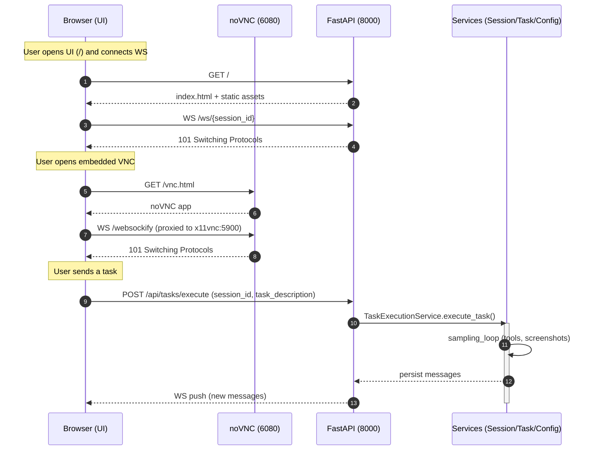

Author: Ashraf Al-Aodat

# GUI-Enabled Backend with noVNC — Dockerized

A fully functional implementation of a GUI-enabled FastAPI backend, containerized with a complete virtual desktop (Xvfb + Mutter + tint2), VNC, and browser-based access via noVNC. The app enables desktop automation and screenshot capture inside the container and exposes an API and static frontend.

## Demo
<a href="demo/engent-ai.webm">demo/engent-ai.webm</a>

## Codebase Overview
<a href="demo/codebase-overview.mov">demo/codebase-overview.mov</a>

## Highlights
- __FastAPI backend__ with session + task execution APIs in `legent-ai/`.
- __Headless GUI stack__ (Xvfb, Mutter, tint2) for desktop automation.
- __noVNC/websockify__ to access the virtual desktop in your browser on port 6080.
- __Hot reload for code and .env__ in dev via uvicorn `--reload` and `python-dotenv`.
- __Docker Compose workflows__ for dev and prod.
- __Persistent screenshots__ stored via a Docker volume in dev and prod.

## Architecture Overview
- Container runs:
  - `Xvfb` virtual display
  - `mutter` window manager + `tint2` panel
  - `x11vnc` for VNC server
  - `noVNC` + `websockify` for browser VNC
  - `uvicorn` serving FastAPI (`legent-ai/main.py`)
- Frontend static UI in `legent-ai/static/` served at `/static` and root `/`.
- Screenshots saved under `legent-ai/static/screenshots/<session_id>/` (mapped to a Docker volume).

## Repository Layout
- `legent-ai/`
  - `main.py` — FastAPI app
  - `services/` — core services (e.g., `task_service.py` for desktop actions and screenshots)
  - `static/` — frontend assets and screenshots path
  - `image/` — Docker assets: `Dockerfile`, `entrypoint.sh`, GUI scripts/configs
- `docker-compose.yml` — Development stack (bind mounts, hot reload, `.env` mount)
- `docker-compose.prod.yml` — Production stack (prebuilt image + volumes)
- `Makefile` — Common tasks with help
- `.env`, `.env.dev`, `.env.prod` — Environment files (dev/prod)

## Prerequisites
- Docker and Docker Compose
- An Anthropic API key (for `ANTHROPIC_API_KEY`)

## Development Setup
1. Clone and enter the repo
   ```bash
   git clone <this-repo-url>
   cd ai
   ```
2. Create `.env` with at least
   ```env
   ANTHROPIC_API_KEY=your-dev-key
   DISPLAY_NUM=1
   WIDTH=1440
   HEIGHT=900
   TZ=UTC
   LOG_LEVEL=debug
   ```
3. Start the dev stack (builds and runs)
   ```bash
   make up
   # or: docker compose up --build
   ```
4. Access
   - API: `http://localhost:8000`
   - UI: `http://localhost:8000/` (serves `legent-ai/static/index.html`)
   - noVNC: `http://localhost:6080/vnc.html`

Troubleshooting tips are in the section below.

## Quick Start (Development)
1. Populate `./.env`:
   ```env
   ANTHROPIC_API_KEY=your-dev-key
   DISPLAY_NUM=1
   WIDTH=1440
   HEIGHT=900
   TZ=UTC
   LOG_LEVEL=debug
   ```
2. Build and run:
   ```bash
   make up
   ```
3. Open:
   - API: http://localhost:8000
   - noVNC: http://localhost:6080/vnc.html
4. Edit code or `.env`: backend hot-reloads automatically.

## Quick Start (Production)
1. Populate `./.env.prod` (or export env via your orchestrator):
   ```env
   ANTHROPIC_API_KEY=your-prod-key
   DISPLAY_NUM=1
   WIDTH=1440
   HEIGHT=900
   TZ=UTC
   ```
2. Build and run:
   ```bash
   make prod-up
   ```
3. Access:
   - API: http://localhost:8000
   - noVNC: http://localhost:6080/vnc.html

## Makefile Commands
Run `make` with no args to see help.

- `make build` — Build backend image
- `make rebuild` — Build image without cache
- `make up` — Start dev stack using `.env`
- `make down` — Stop dev stack
- `make logs` — Tail dev logs
- `make sh` — Shell into backend container (dev)
- `make prod-up` — Start prod stack using `.env.prod`
- `make prod-down` — Stop prod stack
- `make prod-logs` — Tail prod logs

## API Reference

Base URL (dev): `http://localhost:8000`

- __GET `/`__
  - Serves `index.html` from `legent-ai/static/`.

- __Static__
  - GET `/static/...` serves assets under `legent-ai/static/`.

- __POST `/api/sessions`__ → Create session
  - Request:
    ```json
    { "title": "My Session" }
    ```
  - Response: `SessionResponse` (id, title, status, timestamps, message_count, metadata, config)

- __GET `/api/sessions`__ → List sessions
  - Query: `limit`, `offset`

- __GET `/api/sessions/{session_id}`__ → Get session

- __PUT `/api/sessions/{session_id}`__ → Update session
  - Request:
    ```json
    { "title": "Renamed Title", "status": "active" }
    ```

- __DELETE `/api/sessions/{session_id}`__ → Delete session

- __GET `/api/sessions/{session_id}/config`__ → Get agent config
  - Creates a default config if missing.

- __PUT `/api/sessions/{session_id}/config`__ → Update agent config
  - Request (example):
    ```json
    {
      "model": "claude-3-7-sonnet-20250219",
      "provider": "anthropic",
      "tool_version": "v1",
      "max_tokens": 2048,
      "thinking_budget": 2048,
      "token_efficient_tools_beta": true,
      "system_prompt_suffix": ""
    }
    ```

- __POST `/api/sessions/{session_id}/messages`__ → Add user message
  - Request:
    ```json
    { "content": "Hello" }
    ```

- __GET `/api/sessions/{session_id}/messages`__ → List messages
  - Query: `limit`, `offset`

- __POST `/api/tasks/execute`__ → Start async task (agent loop)
  - Request (`TaskRequest`):
    ```json
    {
      "session_id": "<session-id>",
      "task_description": "Open a browser and search for cats"
    }
    ```
  - Response:
    ```json
    { "task_id": "<uuid>", "status": "started" }
    ```

- __WebSocket `/ws/{session_id}`__ → Real-time updates
  - The server broadcasts messages whenever new content is persisted.

noVNC (browser VNC): `http://localhost:6080/vnc.html`

## Environment Variables
- `ANTHROPIC_API_KEY` — required
- `DISPLAY_NUM` — virtual display number; default 1
- `WIDTH`, `HEIGHT` — virtual screen size
- `TZ` — timezone
- `LOG_LEVEL` — optional logging level (e.g., debug, info)

In development:
- `.env` is bind-mounted to `/app/.env` and loaded via `load_dotenv(override=True)` in `main.py`.
- Uvicorn watches `/app` and `.env` for reloads.

## Volumes and Permissions
- Dev: `screenshots_dev` volume mounted at `/app/legent-ai/static/screenshots`.
- Prod: `screenshots` volume (named in `docker-compose.prod.yml`).
- `entrypoint.sh` ensures screenshots dir exists and is writable by the app user.

## Ports
- `8000` — FastAPI
- `6080` — noVNC

## Troubleshooting
- __Screenshots Permission Denied__: ensure you’re using the provided compose files; they mount a Docker volume for screenshots and `entrypoint.sh` sets ownership. Restart with `make down && make up`.
- __noVNC not loading__: check logs for websockify messages; ensure ports 6080/8000 are free.
- __Hot reload not working__: verify `docker-compose.yml` mounts `./legent-ai` and `./.env`, and that uvicorn runs with `--reload`. Run `make logs` to confirm.

## Security Notes
- Do not commit real API keys. Use `.env` files locally and secret managers in production.
- The app will read `.env` in dev; in prod provide envs via orchestrator or `--env-file .env.prod`.

## Sequence Diagram



## Notes
- __File Management__: The file management tool is currently is just a placeholder for the actual file management tool; it is not yet implemented.
- __Search__: The search tool is currently is just a placeholder for the actual search tool; it is not yet implemented. 